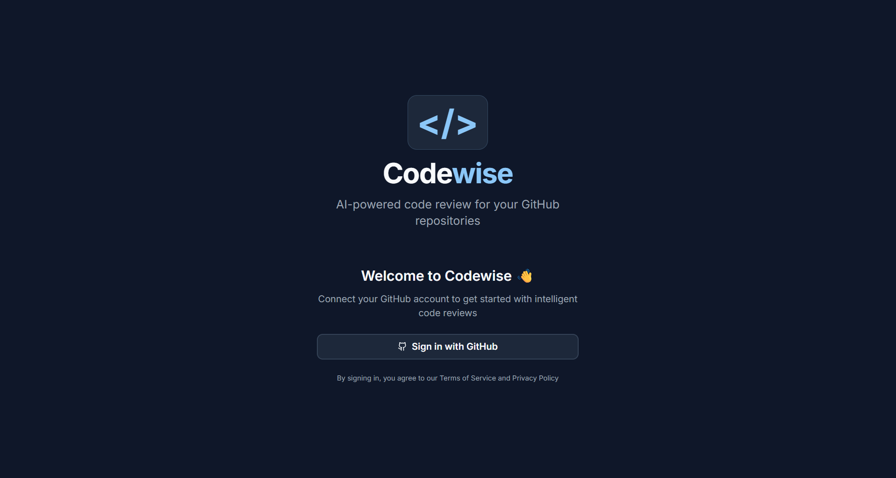
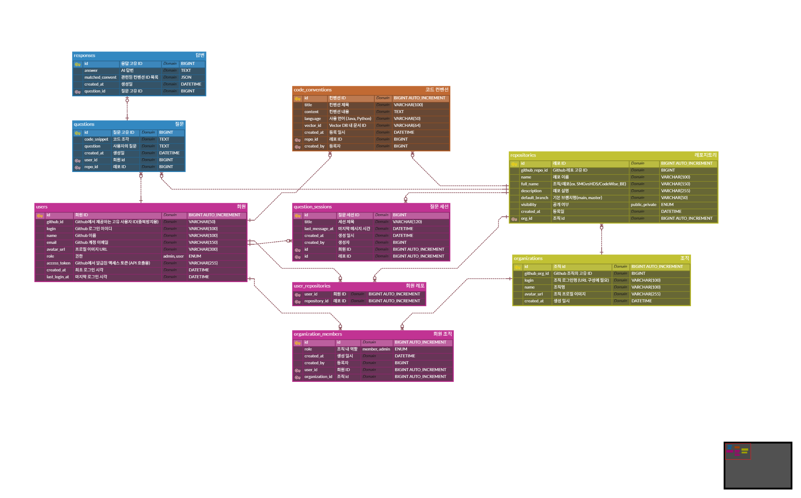

# CodeWise

## 시연영상
[](https://vimeo.com/1135257395)

## 프로젝트 소개
- RAG 기반 코드 리뷰 서비스
- AI와 검색 기반으로 코드 리뷰를 지원하는 웹 애플리케이션

## 프로젝트 개요
- CodeWise는 개발자가 협업 시 일관된 코드 스타일을 유지하고, 코드 리뷰 과정을 효율적으로 지원하는 서비스입니다.

- GitHub와 연동하여 각 레포지토리별 코드 컨벤션을 관리하고, AI는 이를 바탕으로 효율적인 코드 리뷰를 제공합니다.  

## 기능
- Github 로그인
- Github organization 연동
- Github Repository 연동
- Repository 별 코드 컨벤션 관리
- RAG 기반의 채팅 방식 코드 리뷰 제공


## 개발 환경
- Docker Desktop 4.x 이상 및 Compose v2
- Node.js 20 / npm 10 (프런트엔드 Vite 개발 서버)
- Java 21 및 Gradle Wrapper (Spring Boot)
- Python 3.11 / pip (FastAPI)
- MySQL 8.0 (로컬 또는 Docker 컨테이너)

## 기술 스택

- **Frontend**: Vite + React 18 + TypeScript, Tailwind CSS, shadcn/ui, React Query, Nginx (정적 서빙)
- **Backend**: Spring Boot 3, Spring Security OAuth2, JPA/Hibernate, JWT
- **AI Service**: FastAPI, LangChain, Chroma DB, Upstage 연동
- **Database**: MySQL 8.0 (UTF-8MB4 설정)
- **Infra**: Docker, docker-compose, Gradle, npm





## 실행 포트

- FastAPI (AI): `http://localhost:8000`
- Spring Boot API: `http://localhost:8080`
- Frontend (Nginx): `http://localhost:3000`
- MySQL: `localhost:3306`

## 환경 변수

- CodeWise_AI/.env
```shell
# ========= Upstage API =========
UPSTAGE_API_KEY=

# ========= Chroma Vector DB =========
CHROMA_PATH=./chroma_db

# ========= LangSmith =========
LANGCHAIN_TRACING_V2=true
LANGCHAIN_ENDPOINT=https://api.smith.langchain.com
LANGCHAIN_API_KEY=
LANGCHAIN_PROJECT=CodeWise_AI
```


- CodeWise_BE/.env
```shell
MYSQL_DATABASE=codewise
MYSQL_USER=
MYSQL_PASSWORD=
MYSQL_ROOT_PASSWORD=

SPRING_DATASOURCE_URL=jdbc:mysql://localhost:3306/codewise?serverTimezone=Asia/Seoul&characterEncoding=UTF-8

CLIENT_ID=
CLIENT_SECRET=

JWT_SECRET_KEY=

FASTAPI_BASE_URL=http://localhost:8000
FRONTEND_BASE_URL=http://localhost:3000
FRONTEND_LOGIN_SUCCESS_PATH=/login/success

```
- `.env.example`만 커밋하고 실제 값은 로컬에서 관리하세요.


## 실행방법

### 1. Docker Compose 실행

1. 각 서비스의 `.env` 파일을 채운 뒤 루트에서 실행합니다.
   ```bash
   docker compose up --build
   ```
2. 백그라운드로 띄우려면 `docker compose up -d --build`, 종료는 `docker compose down`.
3. 로그 확인: `docker compose logs -f backend` (필요한 서비스명으로 교체).
4. 브라우저에서 `http://localhost:3000`에 접속하면 통합 프론트가 백엔드/AI 컨테이너를 통해 동작합니다.

### 2. 로컬 실행 방법

1. **데이터베이스**
   - MySQL을 직접 실행하거나 `docker compose up db`로 Compose의 DB만 먼저 띄울 수 있습니다.
2. **AI(FastAPI)**
   ```bash
   cd CodeWise_AI
   python -m venv .venv && source .venv/bin/activate  # Windows는 .venv\Scripts\activate
   pip install -r requirements.txt
   uvicorn main:app --host 0.0.0.0 --port 8000
   ```
3. **Backend(Spring Boot)**
   ```bash
   cd CodeWise_BE
   ./gradlew bootRun
   ```
   - `.env`에 MySQL 접속 정보와 `FASTAPI_BASE_URL=http://localhost:8000`, `FRONTEND_BASE_URL=http://localhost:3000` 등을 맞춰둡니다.
4. **Frontend(Vite)**
   ```bash
   cd CodeWise_FE
   npm install
   npm run dev -- --host
   ```
   - `.env` 또는 `vite.config.ts`에서 `VITE_API_BASE_URL=http://localhost:8080`, `VITE_PUBLIC_BACKEND_URL=http://localhost:8080` 설정을 확인하세요.
